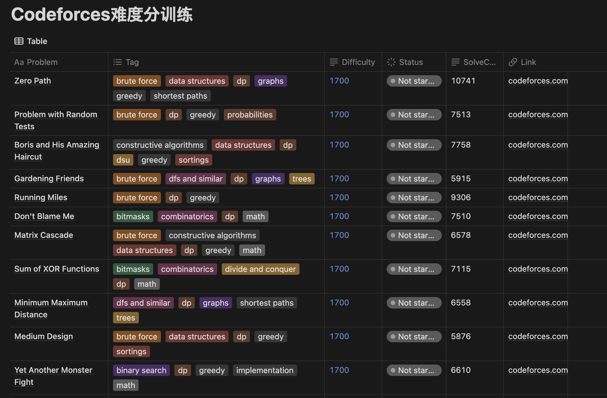

# Codeforces-Notion CLI Tool

A command-line tool that fetches problems from Codeforces based on specified tags and difficulty levels, and stores them in a Notion database. This tool also allows users to filter out solved problems based on their Codeforces handle and provides functionalities to list, archive, and delete problems in the Notion database.




## Features

- **Fetch and Store Problems**: Fetch problems from Codeforces and store them in a Notion database with metadata such as tags, difficulty, solve count, and problem link.
- **Filter Solved Problems**: Exclude problems already solved by the user based on their Codeforces handle.
- **List Problems**: List all problems stored in the Notion database.
- **Archive Problems**: Archive specific problems in the Notion database.
- **Delete All Problems**: Delete all problems in the Notion database.

## Prerequisites

- Node.js installed on your machine.
- A Notion account and a database set up.
- A Codeforces handle.

## Getting Started

### 1. Create a Notion Integration

1.  Go to the [Notion API Getting Started guide](https://developers.notion.com/docs/create-a-notion-integration#getting-started) and follow the instructions to create a new integration.
2.  Give your integration the necessary permissions to access your Notion database. You can find instructions [here](https://developers.notion.com/docs/create-a-notion-integration#give-your-integration-page-permissions).

### 2. Set Up Your Notion Database

You can duplicate [this page](https://fantastic-potassium-767.notion.site/33db213308c44b84b5a05e5298e56888?v=79904238e5b74b4bb1c412c062821724&pvs=25) to start, remember to give your integration permission.

Or you can create a new database in Notion with the following columns:

- **Problem** (Title)
- **Tag** (Multi-select)
- **Difficulty** (Rich text)
- **SolveCount** (Rich text)
- **Link** (URL)

### 3. Clone the Repository And Install Dependencies

```sh
git clone https://github.com/yourusername/codeforces-notion-cli.git
cd notion_cli_cf
npm install
```

### 4. Configure Environment Variables

Create a `.env` file in the root directory and add your Notion API key and database ID:

```sh
NOTION_API_KEY=your_notion_api_key
DATABASE_ID=your_database_id
```

### 4. Usage

```sh
chmod +x cli.js
./cli.js
```


